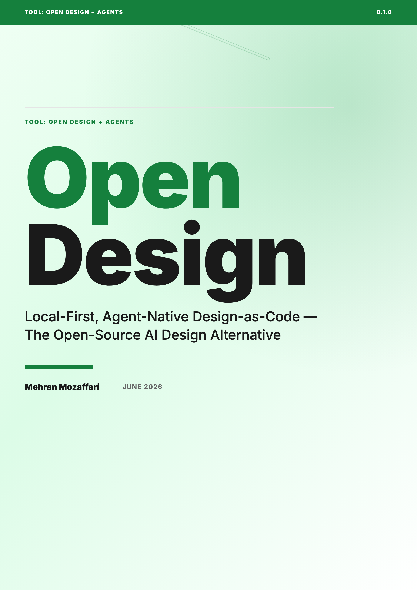

# Open Design

> Local-First, Agent-Native Design-as-Code — The Open-Source AI Design Alternative · by Mehran Mozaffari

Comprehensive coverage of Open Design end to end: the local-first / agent-native paradigm and why it matters; installation and the desktop + daemon architecture (Next.js 16, Express, SQLite, Electron, Docker); the design-skills system (100+ skills) and the 150 bundled brand design systems; generating every artifact type (web and mobile prototypes, HTML presentations, HyperFrames HTML-to-MP4 motion graphics, live dashboards, AI images); the sandboxed iframe preview and export pipeline (HTML, PDF, PPTX, MP4); the 261 official plugins including Figma migration and refresh-existing-codebases-to-brand-spec workflows; the MCP server and integration across 21+ coding-agent CLIs (Claude Code, Cursor, GitHub Copilot, OpenCode, Codex, Gemini CLI, Antigravity, and others) with comparison and routing guidance; multi-agent design teams and orchestration; real-world case studies; a leadership/adoption-evaluation chapter (governance, cost, vendor independence, open-source licensing under Apache-2.0); and the future of local-first autonomous design. Excludes: deep proprietary-cloud-tool tutorials and unrelated general design theory.

## Download

| Format | File |
|--------|------|
| Paged HTML Preview | [open-design-paged.html](open-design-paged.html) |
| ePub | [open-design.epub](open-design.epub) |
| HTML | [open-design.html](open-design.html) |
| PDF | [open-design.pdf](open-design.pdf) |

## What This Book Covers

Comprehensive coverage of Open Design end to end: the local-first / agent-native paradigm and why it matters; installation and the desktop + daemon architecture (Next.js 16, Express, SQLite, Electron, Docker); the design-skills system (100+ skills) and the 150 bundled brand design systems; generating every artifact type (web and mobile prototypes, HTML presentations, HyperFrames HTML-to-MP4 motion graphics, live dashboards, AI images); the sandboxed iframe preview and export pipeline (HTML, PDF, PPTX, MP4); the 261 official plugins including Figma migration and refresh-existing-codebases-to-brand-spec workflows; the MCP server and integration across 21+ coding-agent CLIs (Claude Code, Cursor, GitHub Copilot, OpenCode, Codex, Gemini CLI, Antigravity, and others) with comparison and routing guidance; multi-agent design teams and orchestration; real-world case studies; a leadership/adoption-evaluation chapter (governance, cost, vendor independence, open-source licensing under Apache-2.0); and the future of local-first autonomous design. Excludes: deep proprietary-cloud-tool tutorials and unrelated general design theory.

21 chapters are included in this release.

## Who Is This For

Practitioners building autonomous design workflows - product designers adopting local-first AI tooling and design engineers who want design-as-code and brand-spec refactors via agents. Includes a dedicated chapter for engineering and design leaders evaluating the stack (adoption, governance, cost, and vendor independence).

## Repository Contents

| Path | Purpose |
|------|---------|
| `README.md` | Public landing page for the book repository |
| `CHANGELOG.md` | Version-by-version release notes |
| `LICENSE.md` | Book license |
| `cover.png` | Public cover image generated from the same HTML cover used by the book artifacts |
| `<slug>.pdf` / `<slug>.epub` / `<slug>.html` / `<slug>-paged.html` | Final published book artifacts |

## About the Author

Mehran Mozaffari

## Credits

| Role | Credit |
|------|--------|
| Author | Mehran Mozaffari |
| Editorial review | Multi-model AI review pipeline |
| Technical reviewers | Claude Opus 4.6, Gemini 3.1 Pro |
| Design and production | Agentic publishing pipeline (OpenCode) |

## Contact the Author

- Blog: [https://piazr.github.io/applied-ai/](https://piazr.github.io/applied-ai/)
- GitHub: [https://github.com/imehr](https://github.com/imehr)

For corrections, errata, or licensing inquiries, please open an issue on this repository or contact the author through the channels above.

## Version

- **v0.1.0** — 2026-06-11
- AI tools evolve rapidly; check the official project documentation for current product behavior.

## License

[CC BY-NC-SA 4.0](https://creativecommons.org/licenses/by-nc-sa/4.0/) — free to share and adapt with attribution, non-commercial use only, under the same license.
